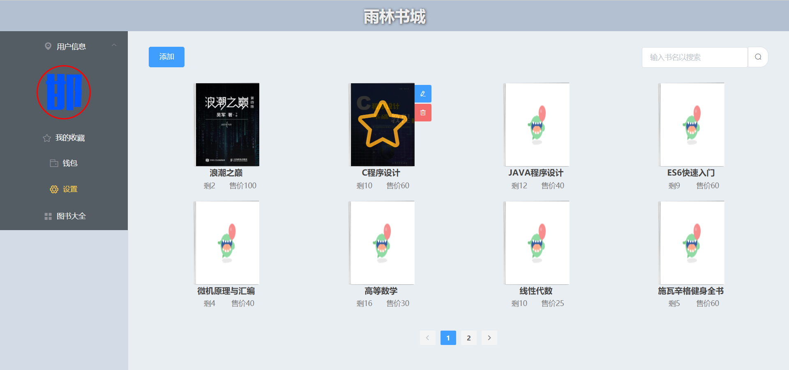

# 项目介绍-雨林书城

Vue3+Tomcat9

## 项目结构

### front_end

vue-cli开发源码，vue-cli版本4.5，vue版本3

使用到的技术：element-plus、axios、stylus等

### server_end

javaWeb(Tomcat9+maven)开发源码，IDEA项目

使用到的技术：JDBC-commons-utils、数据库连接池(Druid)、JSON转换等

## 运行

1.导入sql文件

2.将打包文件解压后放至Tomcat服务器的webapps目录下(不要改动文件夹名称，若出现乱码请检查tomcat编码配置是否为UTF-8)

也可行进行分离部署，但需要在前端代理服务器中设置将 "/yulin/"开头的url 转发到 "tomcat服务器地址/yulin/"

## GIT同步

```
echo "# yulin-bookstore" >> README.md
git init
git add README.md
git commit -m "first commit"
git branch -M main
git remote add origin https://github.com/JustTheice/yulin-bookstore.git
git push -u origin main
```


```
git remote add origin https://github.com/JustTheice/yulin-bookstore.git
git branch -M main
git push -u origin main
```

## 功能说明



项目模拟了书城系统，可以进行用户登陆、图书购买、图书管理等操作

--支持多端同时登陆

--修改个人信息（附带文件上传）

--收藏功能，模拟付款

--模拟充值

--前端进行了很多动画效果的优化

管理员可以添加修改图书信息，普通用户只能进行购买操作

管理员账号admin，密码111（详见数据库文件）

普通用户自行注册即可

由于时间原因，项目可能存在bug。

## 总结

我花了20天左右全面学习java的语法以及javaweb的概念，此后又花了大约一个星期，结合我之前所学的前端知识，做出了这一个小项目。至此，我的软件学习也应该可以先告一段落了。

通过学习javaWeb我对web全栈开发有了更全面的了解，无论是前后端分离还是耦合开发，都是对请求的处理和响应，只不过分离开发响应的是数据，而耦合开发响应的是页面。

我曾学习过node.js，java在语法和设计规范上和node差别很大，java非常注重规范(这也是为什么JAVA中有那么多个接口)，这也决定了它很适合大项目的协作开发，而node则有很高的灵活性（因为据我经验node是没有dao、entiy、servlet...这么多层的，开发者根据个人喜好自行创建相应的文件夹进行分类即可，但这样到了大项目开发可能会出现规范性的问题）。但而二者的思想本质上是相同的，都是对请求进行捕获->处理->响应。java通过servlet和mapping实现，而node则通过路由+处理函数来实现这一点。

总之，我学java体会到最大的特点就是它的规范性。js就像蓬勃发展的青年人，它正在凭借着自己的一些优势不断扩大自己的领域以及尝试确立一套自己的规范，而java就像稳定的中年人，它已经拥有一套完整的设计规范并已成为对开发者的硬性要求，目前在后端领域还是一位非常稳定的坐镇大哥。

